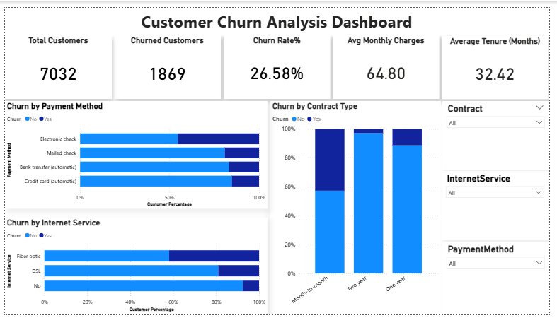
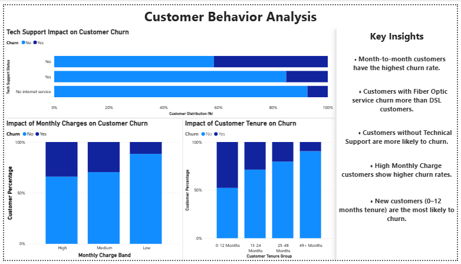

# Customer Churn Analysis

## Project Overview

Customer retention is a critical business challenge for subscription-based companies, as losing customers directly impacts recurring revenue and long-term profitability.

This project analyzes customer demographics, service subscriptions, billing behavior, contract information, and account tenure to identify the key factors driving customer churn. Using Python, SQL, and Power BI, the project demonstrates an end-to-end analytics workflow from data preparation and exploratory analysis to dashboard development and business recommendations.

**Dataset:** IBM Telco Customer Churn Dataset

**Tools Used:** Python (Pandas, NumPy, Matplotlib, Seaborn), SQL, Power BI, GitHub

---

## Business Problem

This project addresses the following business questions:

* What is the overall customer churn rate?
* Which customer segments are most likely to churn?
* How does contract type influence retention?
* What impact do services and billing behavior have on churn?
* Which factors indicate elevated churn risk?
* What actions can improve customer retention?

---

## Dataset Overview

The dataset contains customer demographic information, account details, service subscriptions, billing behavior, and churn outcomes.

| Metric             |  Value |
| ------------------ | -----: |
| Original Records   |  7,043 |
| Final Records      |  7,032 |
| Features           |     21 |
| Churned Customers  |  1,869 |
| Retained Customers |  5,163 |
| Churn Rate         | 26.58% |

### Dataset Categories

**Customer Demographics**

* Gender
* Senior Citizen
* Partner Status
* Dependents

**Account Information**

* Tenure
* Contract Type
* Internet Service

**Service Usage**

* Online Security
* Online Backup
* Device Protection
* Technical Support
* Streaming Services

**Billing Information**

* Monthly Charges
* Total Charges
* Payment Method
* Paperless Billing

**Target Variable**

* Customer Churn

---

## Data Preparation & EDA

The dataset was validated, cleaned, and transformed to ensure accurate churn analysis.

Key preparation steps included:

* Converted `TotalCharges` from text to numeric format.
* Identified 11 records with blank lifetime charges and removed them from the analysis.
* Verified customer-level uniqueness and data consistency.
* Checked missing values and duplicate records.
* Analyzed customer behavior across demographics, tenure, contract type, services, billing behavior, and revenue metrics.
* Created a clean analytical dataset for SQL analysis and dashboard reporting.

The final dataset contained **7,032 customers and 21 features**.

---

## SQL Analysis

SQL was used to validate business metrics, analyze churn drivers, identify high-risk customer groups, and support business decision-making.

Analysis areas included:

* KPI Analysis
* Contract Analysis
* Customer Tenure Analysis
* Revenue Analysis
* Demographic Analysis
* Service Usage Analysis
* Billing Analysis
* Customer Risk Segmentation
* Advanced SQL Analysis using CTEs, Window Functions, Ranking Functions, and Views

### Sample Query

```sql
SELECT
    Contract,
    ROUND(
        AVG(CASE WHEN Churn='Yes' THEN 1 ELSE 0 END) * 100,
        2
    ) AS churn_rate
FROM telco_churn
GROUP BY Contract
ORDER BY churn_rate DESC;
```

---

## Dashboard Overview

### Dashboard Page 1 – Executive Churn Overview

This dashboard provides an executive-level view of customer retention performance, churn distribution, contract analysis, revenue metrics, and service-level churn patterns.

Key KPIs highlight a total customer base of 7,032 customers with an overall churn rate of 26.58%, helping identify the primary drivers of customer attrition.



---

### Dashboard Page 2 – Customer Behavior & Risk Analysis

This dashboard focuses on customer tenure, technical support adoption, billing behavior, internet service usage, and high-risk customer segments.

The analysis highlights significant churn concentration among month-to-month customers, newer customers, and customers without technical support, providing actionable insights for retention-focused business strategies.



---

## Key Business Insights

* Overall customer churn rate was **26.58%**, indicating that approximately one in four customers discontinued their service.
* Month-to-month customers recorded the highest churn rate at **42.71%**, compared to **11.28%** for one-year contracts and **2.85%** for two-year contracts. Contract commitment emerged as the strongest retention driver.
* Customers with less than 12 months of tenure experienced significantly higher churn than long-term customers, suggesting that retention efforts should be concentrated during the early stages of the customer lifecycle.
* Customers without technical support showed a churn rate of **41.65%**, nearly three times higher than customers receiving support services, highlighting the importance of service engagement in customer retention.
* Fiber optic customers recorded a churn rate of **41.89%**, making them one of the highest-risk customer groups. This may indicate opportunities to improve customer experience, service quality, or pricing strategies.
* Electronic check users experienced the highest churn rate at **45.29%**, suggesting that payment behavior can serve as an early indicator of churn risk.
* Churned customers paid higher average monthly charges (**74.44**) than retained customers (**61.31**), indicating greater price sensitivity among higher-paying customers.

---

## Business Recommendations

* Promote long-term contracts to improve customer retention.
* Focus retention efforts on customers within their first year.
* Increase adoption of technical support services.
* Investigate churn drivers among Fiber Optic subscribers.
* Encourage automatic payment enrollment.
* Develop proactive retention campaigns for high-risk customer groups.

---

## Skills Demonstrated

* Data Cleaning & Validation
* Exploratory Data Analysis (EDA)
* Customer Churn Analytics
* SQL Query Development
* Advanced SQL (CTEs, Window Functions, Views)
* KPI Development
* Power BI Dashboard Design
* Business Intelligence Reporting
* Data Storytelling
* Business Insight Generation

---

## Project Files

* **churn_analysis.ipynb** — Data Cleaning, EDA, and Churn Analysis
* **telco_churn_analysis.sql** — SQL Queries and Business Analysis
* **cleaned_telco_churn.csv** — Final Analytical Dataset
* **customer_churn_analysis_dashboard.pbix** — Interactive Power BI Dashboard
* **churn_dashboard_overview.png** — Dashboard Preview
* **customer_behavior_analysis.png** — Dashboard Preview

---

## Repository Structure

```text
customer-churn-analysis/

├── README.md
├── churn_analysis.ipynb
├── telco_churn_analysis.sql
├── cleaned_telco_churn.csv
├── customer_churn_analysis_dashboard.pbix
├── churn_dashboard_overview.png
└── customer_behavior_analysis.png
```

---

## Business Takeaway

The analysis revealed that customer churn is primarily influenced by contract type, customer tenure, technical support adoption, internet service selection, and billing behavior. Month-to-month customers, newer customers, and customers without support services demonstrated the highest churn risk.

These findings can help businesses design targeted retention strategies, reduce customer attrition, protect recurring revenue, and improve long-term customer value.

This project demonstrates an end-to-end analytics workflow using Python, SQL, and Power BI to transform raw customer data into actionable business insights.
